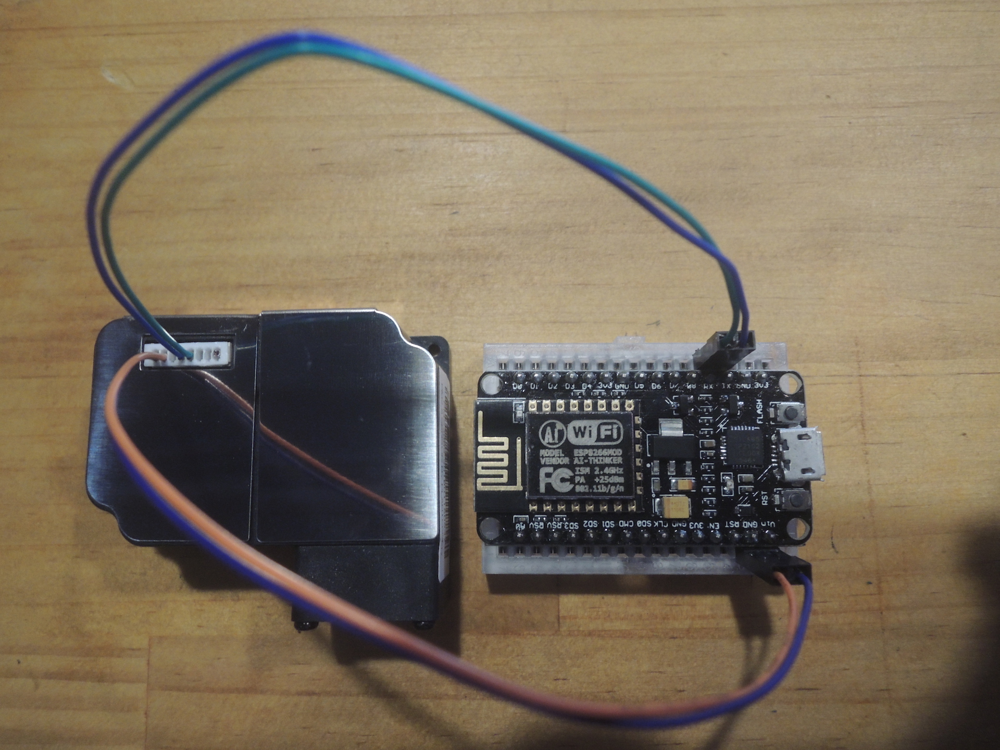
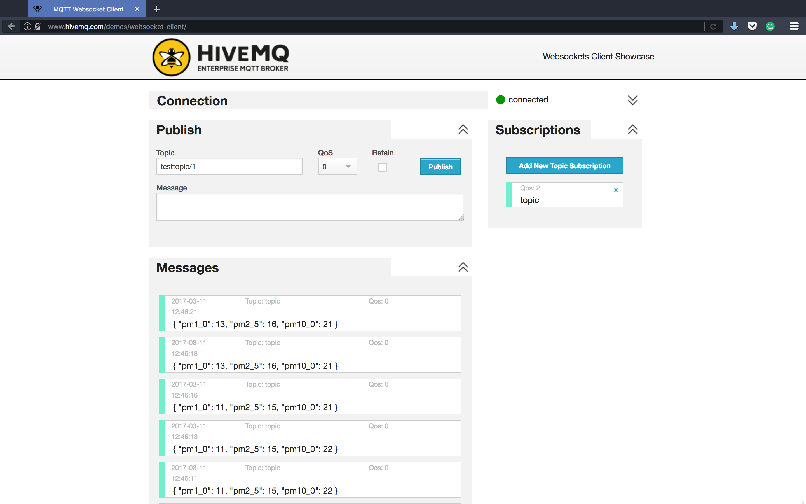

# MQTT Air Quality Monitoring Station
A [MQTT][mqtt]-based air quality monitoring station firmware. We use [NodeMcu][node-mcu] (Arduino-like board with ESP8266 Wi-Fi chip) and [PMS3003 air quality sensor][pms3003] here.

## Setup
1. Update the [SSID][ssid], [Wi-Fi password][password], and [MQTT topic][topic] (you can name it with any name you want) in the firmware, and flash the firmware with Arduino IDE. (Please ensure unplug the air quality sensor from the board when you do flashing. Because TX and RX will be used when do flashing)
2. Check the data with a MQTT client. Go to the [HiveMQ MQTT client web page][mqtt-client] and subscribe the [topic][topic] you assigned in the firmware.

[mqtt]: https://en.wikipedia.org/wiki/MQTT
[node-mcu]: http://www.nodemcu.com/index_en.html
[pms3003]: http://aqicn.org/sensor/pms3003
[mqtt-client]: http://www.hivemq.com/demos/websocket-client/
[ssid]: https://github.com/evanxd/mqtt-air-quality-monitoring-station/blob/master/mqtt-air-quality-monitoring-station.ino#L4
[password]: https://github.com/evanxd/mqtt-air-quality-monitoring-station/blob/master/mqtt-air-quality-monitoring-station.ino#L5
[topic]: https://github.com/evanxd/mqtt-air-quality-monitoring-station/blob/master/mqtt-air-quality-monitoring-station.ino#L9
